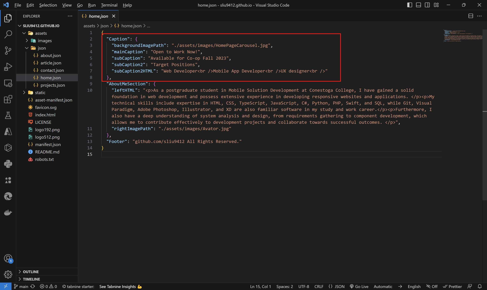

# React-Personal-Website

This React project is used to build a static responsive ePortfolio, the majority of content of this project is store in the json files under the assets folder, thus, it's unnecessary to refactor the project and build it again.

## Built files repository

[GitHub - sliu9412/sliu9412.github.io: The built project of https://github.com/sliu9412/React-Personal-Website](https://github.com/sliu9412/sliu9412.github.io)

## Example

The Caption part mapping 

